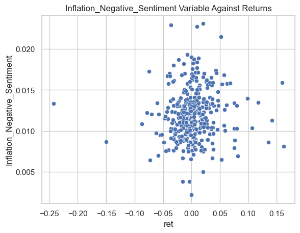

# Assessing 10-K Sentiment on Firm Returns
## Jon Trzaska

### **Abstract**

This deep dive into financial analysis explores the technicalities of using Edgar and data science to one's maximum advantage. Utilizing the full extent of free use financial data, this project examines the topic of 10-K sentiment and how it influences the returns of a firm. Specifically, it includes the scraping of S&P500 10-Ks and assigning both positive and negative sentiment values which are based off of pre-made sentiment dictionaries. This project ultimately answered the question of how 10-K language impacts the financial outlook of a firm, information that can be used both by firms and individuals to advance their own advantages. 

### **Data**
    
This study follows the some of the largest firms on the planet, those within the S&P 500. Utilizing this sample allows for an easy and recognizable source of data that ultimately results in significant meaning from our findings at the end. Being able to create and manipulate data to one's advantage on the world's top companies is a powerful tool. The backbone of this analysis is the sp500 dataframe that contains all of the values that were obtained throughout the projects. Starting with just two columns for a ticker and CIK, it grew into a robust dataframe that propelled the analysis throughout.


```python
import fnmatch
import glob
import os
import re
from time import sleep
from zipfile import ZipFile
import numpy as np
import pandas as pd

sp500 = pd.read_csv('output/analysis_sample.csv')
sp500
```


<div>
<style scoped>
    .dataframe tbody tr th:only-of-type {
        vertical-align: middle;
    }

    .dataframe tbody tr th {
        vertical-align: top;
    }

    .dataframe thead th {
        text-align: right;
    }
</style>
<table border="1" class="dataframe">
  <thead>
    <tr style="text-align: right;">
      <th></th>
      <th>Symbol</th>
      <th>CIK</th>
      <th>Accession_Number</th>
      <th>Filing_Date</th>
      <th>BHR_Positive_Sentiment</th>
      <th>BHR_Negative_Sentiment</th>
      <th>LM_Positive_Sentiment</th>
      <th>LM_Negative_Sentiment</th>
      <th>Inflation_Negative_Sentiment</th>
      <th>Inflation_Positive_Sentiment</th>
      <th>...</th>
      <th>mb</th>
      <th>prof_a</th>
      <th>ppe_a</th>
      <th>cash_a</th>
      <th>xrd_a</th>
      <th>dltt_a</th>
      <th>invopps_FG09</th>
      <th>sales_g</th>
      <th>dv_a</th>
      <th>short_debt</th>
    </tr>
  </thead>
  <tbody>
    <tr>
      <th>0</th>
      <td>A</td>
      <td>1090872</td>
      <td>0000046619-22-000066</td>
      <td>2022-12-21</td>
      <td>0.025263</td>
      <td>0.018774</td>
      <td>0.004013</td>
      <td>0.008651</td>
      <td>0.015608</td>
      <td>0.015608</td>
      <td>...</td>
      <td>4.942619</td>
      <td>0.161233</td>
      <td>0.104904</td>
      <td>0.147128</td>
      <td>0.041196</td>
      <td>0.267071</td>
      <td>4.734700</td>
      <td>0.183555</td>
      <td>0.022046</td>
      <td>0.017863</td>
    </tr>
    <tr>
      <th>1</th>
      <td>AAL</td>
      <td>6201</td>
      <td>0000006201-22-000026</td>
      <td>2022-02-22</td>
      <td>0.017957</td>
      <td>0.023794</td>
      <td>0.002809</td>
      <td>0.013274</td>
      <td>0.008439</td>
      <td>0.008439</td>
      <td>...</td>
      <td>1.285453</td>
      <td>-0.047828</td>
      <td>0.562490</td>
      <td>0.201920</td>
      <td>0.000000</td>
      <td>0.634616</td>
      <td>0.868619</td>
      <td>0.723597</td>
      <td>0.000000</td>
      <td>0.086537</td>
    </tr>
    <tr>
      <th>2</th>
      <td>AAP</td>
      <td>1158449</td>
      <td>0001158449-22-000037</td>
      <td>2022-02-15</td>
      <td>0.025962</td>
      <td>0.025993</td>
      <td>0.005076</td>
      <td>0.017441</td>
      <td>0.010120</td>
      <td>0.010120</td>
      <td>...</td>
      <td>1.963279</td>
      <td>0.095247</td>
      <td>0.344436</td>
      <td>0.049321</td>
      <td>0.000000</td>
      <td>0.276522</td>
      <td>1.540528</td>
      <td>0.088229</td>
      <td>0.013197</td>
      <td>0.121217</td>
    </tr>
    <tr>
      <th>3</th>
      <td>AAPL</td>
      <td>320193</td>
      <td>0000320193-22-000108</td>
      <td>2022-10-28</td>
      <td>0.020384</td>
      <td>0.026536</td>
      <td>0.003438</td>
      <td>0.019268</td>
      <td>0.013419</td>
      <td>0.013419</td>
      <td>...</td>
      <td>7.442414</td>
      <td>0.337460</td>
      <td>0.141102</td>
      <td>0.178458</td>
      <td>0.062433</td>
      <td>0.340115</td>
      <td>NaN</td>
      <td>0.332594</td>
      <td>0.041216</td>
      <td>0.125555</td>
    </tr>
    <tr>
      <th>4</th>
      <td>ABBV</td>
      <td>1551152</td>
      <td>0001551152-22-000007</td>
      <td>2022-02-18</td>
      <td>0.019753</td>
      <td>0.022645</td>
      <td>0.006481</td>
      <td>0.015448</td>
      <td>0.010055</td>
      <td>0.010055</td>
      <td>...</td>
      <td>2.528878</td>
      <td>0.194433</td>
      <td>0.040074</td>
      <td>0.067086</td>
      <td>0.054911</td>
      <td>0.442929</td>
      <td>2.144449</td>
      <td>0.227438</td>
      <td>0.063203</td>
      <td>0.163364</td>
    </tr>
    <tr>
      <th>...</th>
      <td>...</td>
      <td>...</td>
      <td>...</td>
      <td>...</td>
      <td>...</td>
      <td>...</td>
      <td>...</td>
      <td>...</td>
      <td>...</td>
      <td>...</td>
      <td>...</td>
      <td>...</td>
      <td>...</td>
      <td>...</td>
      <td>...</td>
      <td>...</td>
      <td>...</td>
      <td>...</td>
      <td>...</td>
      <td>...</td>
      <td>...</td>
    </tr>
    <tr>
      <th>345</th>
      <td>XOM</td>
      <td>34088</td>
      <td>0000034088-22-000011</td>
      <td>2022-02-23</td>
      <td>0.024162</td>
      <td>0.027896</td>
      <td>0.005877</td>
      <td>0.010382</td>
      <td>0.013061</td>
      <td>0.013061</td>
      <td>...</td>
      <td>1.267929</td>
      <td>0.128301</td>
      <td>0.656887</td>
      <td>0.020069</td>
      <td>0.002487</td>
      <td>0.139802</td>
      <td>0.868785</td>
      <td>0.549453</td>
      <td>0.044034</td>
      <td>0.106489</td>
    </tr>
    <tr>
      <th>346</th>
      <td>XRAY</td>
      <td>818479</td>
      <td>0000818479-22-000015</td>
      <td>2022-03-01</td>
      <td>0.024369</td>
      <td>0.028447</td>
      <td>0.005351</td>
      <td>0.019969</td>
      <td>0.011717</td>
      <td>0.011717</td>
      <td>...</td>
      <td>1.772026</td>
      <td>0.107046</td>
      <td>0.105098</td>
      <td>0.036692</td>
      <td>0.018508</td>
      <td>0.223184</td>
      <td>1.524790</td>
      <td>0.266008</td>
      <td>0.009958</td>
      <td>0.101133</td>
    </tr>
    <tr>
      <th>347</th>
      <td>XYL</td>
      <td>1524472</td>
      <td>0001524472-22-000009</td>
      <td>2022-02-25</td>
      <td>0.031256</td>
      <td>0.031172</td>
      <td>0.007049</td>
      <td>0.017495</td>
      <td>0.013357</td>
      <td>0.013357</td>
      <td>...</td>
      <td>3.225061</td>
      <td>0.103432</td>
      <td>0.114548</td>
      <td>0.163001</td>
      <td>0.024650</td>
      <td>0.324190</td>
      <td>2.909645</td>
      <td>0.065422</td>
      <td>0.024529</td>
      <td>0.025073</td>
    </tr>
    <tr>
      <th>348</th>
      <td>YUM</td>
      <td>1041061</td>
      <td>0001564590-22-007640</td>
      <td>2022-02-28</td>
      <td>0.025014</td>
      <td>0.023482</td>
      <td>0.006078</td>
      <td>0.016549</td>
      <td>0.008951</td>
      <td>0.008951</td>
      <td>...</td>
      <td>9.129993</td>
      <td>0.395240</td>
      <td>0.337915</td>
      <td>0.123366</td>
      <td>0.000000</td>
      <td>1.019505</td>
      <td>8.944086</td>
      <td>0.164897</td>
      <td>0.099229</td>
      <td>0.012864</td>
    </tr>
    <tr>
      <th>349</th>
      <td>ZBRA</td>
      <td>877212</td>
      <td>0000877212-22-000026</td>
      <td>2022-02-10</td>
      <td>0.028396</td>
      <td>0.026842</td>
      <td>0.006258</td>
      <td>0.014964</td>
      <td>0.012240</td>
      <td>0.012240</td>
      <td>...</td>
      <td>5.635335</td>
      <td>0.192759</td>
      <td>0.064843</td>
      <td>0.055350</td>
      <td>0.091231</td>
      <td>0.167820</td>
      <td>5.301699</td>
      <td>0.265063</td>
      <td>0.000000</td>
      <td>0.089083</td>
    </tr>
  </tbody>
</table>
<p>350 rows × 82 columns</p>
</div>


**Returns**

Calculating the returns for each firm in the S&P presented a big challenge, however, being able to utilize the crsp_2022 dataset was a help. This dataset already contained every firms' returns for every date, the trick was to get the return from the filing date. To get this return value required manipulation of the crsp dataset, specifically, adjusting the name of its columns. By matching the columns that contained a company's ticker and date of returns to match the same names as the sp500 dataset, it allowed for a simple inner merge as shown below on the variables "Symbol" and "Filing_Date". The new sp500 dataset, post-merge, contained the returns on the day of the firm's 10-K filing. 

    `sp500 = sp500.merge(crsp,on = ['Symbol','Filing_Date'], how='inner')`
    
**Contextual Sentiment**
    
Obtaining the values for contextual sentiment involved a much more complicated process than the returns. To briefly introduce, the strategy for obtaining these variables was to iterate through the sp500 dataframe, going firm by firm, to individually download, clean, and perform analysis on the raw html of a 10-K. As one might expect, this is resopnsible for the bulk of the time taken by the build_sample file and the majority of the written code. An example of the process to obtain each instance of raw html is shown below. 

`clean_html_list=[]

with ZipFile('10k_files/10k_files.zip','r') as zipfolder:
    
    # before the loop, get list of files in zipped folder
    file_list = zipfolder.namelist()
        
    # replace this with how you'd loop over the dataframe
    for firm in tqdm(sp500['Symbol']): #,"MMM","TSLA"]:
        
        # get a list of possible files for this firm
        firm_folder    = "sec-edgar-filings/" + firm + '/10-K/*/*.html'
        possible_files = fnmatch.filter(file_list, firm_folder) 
        if len(possible_files) == 0: 
            continue
            
        fpath = possible_files[0] # the first match is the path to the file
        
        # open the file (this is a little different!)
        with zipfolder.open(fpath) as report_file:
            html = report_file.read().decode(encoding="utf-8")
            
            soup = BeautifulSoup(html,features='lxml-xml')

            for div in soup.find_all("div", {'style':'display:none'}): 
                div.decompose()
    
            lower = soup.get_text().lower()    
            no_punc = re.sub(r'\W',' ',lower)    
            cleaned = re.sub(r'\s+',' ',no_punc)   
            
            clean_html_list.append(cleaned)`

Once this html was cleaned, the process began to extract value from it. In order to assess the sentiment of a firm's 10-K, a regex function was used to scan through each 10-K individually and count the number of times a word labeled as "positive" or "negative" appeared. There were two different lists that had these marker values and thus, there are four different variables that describe a 10-K's positive and negative sentiment. 

Outside of these positive and negative variables, there are also three lists and separately contain words that describe inflation, litigation, and natural disasters. I personally chose these categories for separate reasons. One, I am generally curious about how common artifical factors influence the outlook of a firm, thus inflation and litigation. Two, I could not help but wonder what type of affect, if any, natural disasters might play in a firm's financial status. It seems quite obvious that large-scale events like earthquakes or hurricanes could influence a firm's operations, but it is just not something I think most people would even think of when something like that happens. And maybe that is for good reason; do we really care about the corporations when lives are being lost? Nonetheless, it is thought provoking. The code utilizing a regex function to assess sentiment is shown below. 

`for index, row in tqdm(sp500.iterrows()):    
    count = 0 
    for group in LM_negative_final:
        group = ['('+'|'.join(group)+')'] 
        count = count + len(re.findall(NEAR_regex(group),row['clean_html']))
        
    sentiment_score = ((count) / len(row['clean_html'].split()))
    sentiment_list.append(sentiment_score)`
    


```python
sp500.describe()
```


<div>
<style scoped>
    .dataframe tbody tr th:only-of-type {
        vertical-align: middle;
    }

    .dataframe tbody tr th {
        vertical-align: top;
    }

    .dataframe thead th {
        text-align: right;
    }
</style>
<table border="1" class="dataframe">
  <thead>
    <tr style="text-align: right;">
      <th></th>
      <th>CIK</th>
      <th>BHR_Positive_Sentiment</th>
      <th>BHR_Negative_Sentiment</th>
      <th>LM_Positive_Sentiment</th>
      <th>LM_Negative_Sentiment</th>
      <th>Inflation_Negative_Sentiment</th>
      <th>Inflation_Positive_Sentiment</th>
      <th>Litigation_Positive_Sentiment</th>
      <th>Litigation_Negative_Sentiment</th>
      <th>Disaster_Positive_Sentiment</th>
      <th>...</th>
      <th>mb</th>
      <th>prof_a</th>
      <th>ppe_a</th>
      <th>cash_a</th>
      <th>xrd_a</th>
      <th>dltt_a</th>
      <th>invopps_FG09</th>
      <th>sales_g</th>
      <th>dv_a</th>
      <th>short_debt</th>
    </tr>
  </thead>
  <tbody>
    <tr>
      <th>count</th>
      <td>3.500000e+02</td>
      <td>350.000000</td>
      <td>350.000000</td>
      <td>350.000000</td>
      <td>350.000000</td>
      <td>350.000000</td>
      <td>350.000000</td>
      <td>350.000000</td>
      <td>350.000000</td>
      <td>350.000000</td>
      <td>...</td>
      <td>350.000000</td>
      <td>350.000000</td>
      <td>350.000000</td>
      <td>350.000000</td>
      <td>350.000000</td>
      <td>350.000000</td>
      <td>327.000000</td>
      <td>349.000000</td>
      <td>350.000000</td>
      <td>350.000000</td>
    </tr>
    <tr>
      <th>mean</th>
      <td>7.841928e+05</td>
      <td>0.024275</td>
      <td>0.026064</td>
      <td>0.005195</td>
      <td>0.016094</td>
      <td>0.012017</td>
      <td>0.012017</td>
      <td>0.005789</td>
      <td>0.005789</td>
      <td>0.000337</td>
      <td>...</td>
      <td>3.558596</td>
      <td>0.156369</td>
      <td>0.243473</td>
      <td>0.131816</td>
      <td>0.028317</td>
      <td>0.320122</td>
      <td>3.213289</td>
      <td>0.278940</td>
      <td>0.023719</td>
      <td>0.093321</td>
    </tr>
    <tr>
      <th>std</th>
      <td>5.642153e+05</td>
      <td>0.003768</td>
      <td>0.003370</td>
      <td>0.001371</td>
      <td>0.003376</td>
      <td>0.003090</td>
      <td>0.003090</td>
      <td>0.002520</td>
      <td>0.002520</td>
      <td>0.000308</td>
      <td>...</td>
      <td>2.869384</td>
      <td>0.085444</td>
      <td>0.211607</td>
      <td>0.120882</td>
      <td>0.044031</td>
      <td>0.186396</td>
      <td>2.899540</td>
      <td>0.805532</td>
      <td>0.026908</td>
      <td>0.090624</td>
    </tr>
    <tr>
      <th>min</th>
      <td>1.800000e+03</td>
      <td>0.003530</td>
      <td>0.014692</td>
      <td>0.000272</td>
      <td>0.007327</td>
      <td>0.002172</td>
      <td>0.002172</td>
      <td>0.001932</td>
      <td>0.001932</td>
      <td>0.000000</td>
      <td>...</td>
      <td>0.878375</td>
      <td>-0.099432</td>
      <td>0.013654</td>
      <td>0.003713</td>
      <td>0.000000</td>
      <td>0.002061</td>
      <td>0.481436</td>
      <td>-0.658981</td>
      <td>0.000000</td>
      <td>0.000000</td>
    </tr>
    <tr>
      <th>25%</th>
      <td>9.727650e+04</td>
      <td>0.022469</td>
      <td>0.023975</td>
      <td>0.004361</td>
      <td>0.013666</td>
      <td>0.010057</td>
      <td>0.010057</td>
      <td>0.004169</td>
      <td>0.004169</td>
      <td>0.000166</td>
      <td>...</td>
      <td>1.657181</td>
      <td>0.099467</td>
      <td>0.093193</td>
      <td>0.044793</td>
      <td>0.000000</td>
      <td>0.198376</td>
      <td>1.349169</td>
      <td>0.082258</td>
      <td>0.000000</td>
      <td>0.026860</td>
    </tr>
    <tr>
      <th>50%</th>
      <td>8.780695e+05</td>
      <td>0.024508</td>
      <td>0.026090</td>
      <td>0.005122</td>
      <td>0.015892</td>
      <td>0.011665</td>
      <td>0.011665</td>
      <td>0.005190</td>
      <td>0.005190</td>
      <td>0.000259</td>
      <td>...</td>
      <td>2.564622</td>
      <td>0.142072</td>
      <td>0.162383</td>
      <td>0.097425</td>
      <td>0.008529</td>
      <td>0.301219</td>
      <td>2.198468</td>
      <td>0.158201</td>
      <td>0.017351</td>
      <td>0.065210</td>
    </tr>
    <tr>
      <th>75%</th>
      <td>1.143604e+06</td>
      <td>0.026430</td>
      <td>0.028114</td>
      <td>0.005864</td>
      <td>0.018070</td>
      <td>0.013561</td>
      <td>0.013561</td>
      <td>0.006460</td>
      <td>0.006460</td>
      <td>0.000413</td>
      <td>...</td>
      <td>4.324779</td>
      <td>0.201171</td>
      <td>0.338943</td>
      <td>0.171404</td>
      <td>0.041204</td>
      <td>0.406424</td>
      <td>3.904333</td>
      <td>0.284603</td>
      <td>0.036439</td>
      <td>0.125380</td>
    </tr>
    <tr>
      <th>max</th>
      <td>1.841666e+06</td>
      <td>0.037982</td>
      <td>0.038030</td>
      <td>0.010899</td>
      <td>0.026658</td>
      <td>0.023092</td>
      <td>0.023092</td>
      <td>0.020365</td>
      <td>0.020365</td>
      <td>0.003184</td>
      <td>...</td>
      <td>14.733148</td>
      <td>0.405925</td>
      <td>0.888302</td>
      <td>0.607837</td>
      <td>0.295576</td>
      <td>1.019505</td>
      <td>14.066011</td>
      <td>14.183099</td>
      <td>0.164573</td>
      <td>0.530059</td>
    </tr>
  </tbody>
</table>
<p>8 rows × 78 columns</p>
</div>


Above shows the summary statistics of my analysis sample. While the base positive and negative samples utilizing the BHR and LM lists seem fine, there is clearly something abnormal with my three added sentiment variables. Both the positive and negative versions of all three have the same values, which should not be the case. This underscores the two big issues I had in conducting this entire analysis: regex and returns. I faced a lot of difficulty working through the intricacies of regex and the formulaic process of finding the returns across multiple days. This will become much more recognizable in the visualizations that were created for each variable. 

### **Results**

**Visualizations**


```python
from string import ascii_letters
import numpy as np
import pandas as pd
import seaborn as sns
import matplotlib.pyplot as plt

sp500_subset = sp500[['ret','BHR_Positive_Sentiment','BHR_Negative_Sentiment','LM_Positive_Sentiment','LM_Negative_Sentiment','Inflation_Positive_Sentiment','Inflation_Negative_Sentiment','Litigation_Positive_Sentiment','Litigation_Negative_Sentiment','Disaster_Positive_Sentiment','Disaster_Negative_Sentiment']]
matrix = sp500_subset.corr()

sns.heatmap(matrix, annot=True)
plt.show()
sns.set(font_scale=0.40)
```


    

    


```python
sns.set_theme(style="whitegrid")
a = sns.scatterplot(data=sp500_subset,x='ret',y='BHR_Positive_Sentiment').set_title('BHR_Positive_Sentiment Variable Against Returns')
```


    

    


```python
b = sns.scatterplot(data=sp500_subset,x='ret',y='BHR_Negative_Sentiment').set_title('BHR_Negative_Sentiment Variable Against Returns')
```


    

    


```python
c = sns.scatterplot(data=sp500_subset,x='ret',y='LM_Positive_Sentiment').set_title('LM_Positive_Sentiment Variable Against Returns')
```


    

    


```python
d = sns.scatterplot(data=sp500_subset,x='ret',y='LM_Negative_Sentiment').set_title('LM_Negative_Sentiment Variable Against Returns')
```


    

    


```python
e = sns.scatterplot(data=sp500_subset,x='ret',y='Inflation_Positive_Sentiment').set_title('Inflation_Positive_Sentiment Variable Against Returns')
```


    

    


```python
f = sns.scatterplot(data=sp500_subset,x='ret',y='Inflation_Negative_Sentiment').set_title('Inflation_Negative_Sentiment Variable Against Returns')
```


    

    


```python
g = sns.scatterplot(data=sp500_subset,x='ret',y='Litigation_Positive_Sentiment').set_title('Litigation_Positive_Sentiment Variable Against Returns')
```


    

    


```python
h = sns.scatterplot(data=sp500_subset,x='ret',y='Litigation_Negative_Sentiment').set_title('Litigation_Negative_Sentiment Variable Against Returns')
```


    

    


```python
i = sns.scatterplot(data=sp500_subset,x='ret',y='Disaster_Positive_Sentiment').set_title('Disaster_Positive_Sentiment Variable Against Returns')
```


    

    


```python
j = sns.scatterplot(data=sp500_subset,x='ret',y='Disaster_Negative_Sentiment').set_title('Disaster_Negative_Sentiment Variable Against Returns')
```


    

    


**Discussion Topics**

Despite the vast differences in size between the ML dictionary and the LM dictionary, there seems to be a miniscule difference between the distribution of the both dictionaries when plotted against the returns. Even across the dictionaries, there is no major difference in regard to positive versus negative as well. This is likely due to the fact that the return variable in this particular sample is solely the firm's return on the day of filing. I would anticipate that returns across 2 days and across an entire week would create a more chaotic mapping of sentiment against returns. 

It seems that despite my lack of continuity in regard to returns, I still followed the same pattern in the sense that I found no meaningful difference between the two different dictionaries. I think one silver lining of the work done by Garcia, Hu, and Rohrer is reassurance. They hypothesized that the overarching dictionary was not tailored enough to the specific scenario that it was being used in and maybe they were right? Though at first glance it seems fruitful, they can be reassured now that the findings are accurate because they were verified with more appropriate methods. 

Looking through the visualizations of the lists of inflation, litigation, and natural disasters presents at least one pleasant surprise. Despite my shortcomings with regex, the volatility of natural disasters still shines through! How exciting! In comparison to the regular sentiment dictionaries and that graphs of inflation and litigation, the distribution of sentiment as a result of natural disasters spreads the returns much wider then the others. It has a flatter shape overall and what might make more sense is how low it is on the graph. From this, one could suppose that while natural disasters influence the sentiment of a 10-K significantly less often, when it does impact the sentiment, it influences returns in a much more impactful way, which is definitely believable. Its simple; natural disasters are rare, but when they happen there's nothing a firm can really do about it but bite the bullet and eat the consequences. 

On the other hand, the inflation and litigation contextual variables were more tame. Unlike natural disaster, they have more boring distributions that fall more in line with the distributions of LM and ML dictionary lists. There is no real differentiation from in the magnitude *or* sign. My hypothesis is that these topics are much more in line with typical business acumen. The words in this list or more often used in business and are even more likely to even be in the LM and ML lists, especially when compared to natural disasters. 

